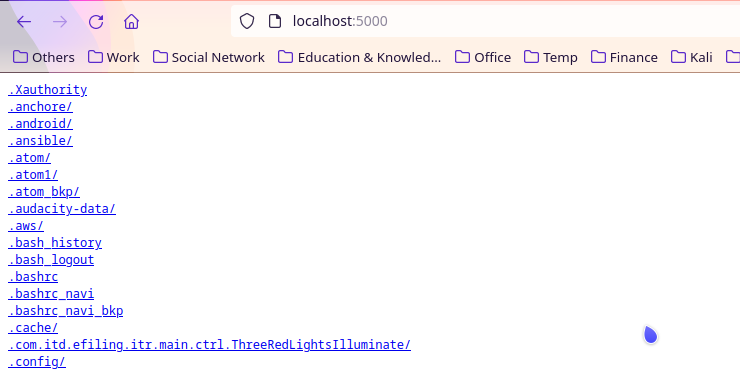

# fileserver
Serve you file on http

## Usage of fileserver

  -path string

        Path to serve (default "/tmp")

  -port string

        Port to listen on (default "3000")

## Example

```
navi@navi-kubuntu:~$ fileserver --port=5000 --path=/home/navi
Serving files under /home/navi on port 5000
```

